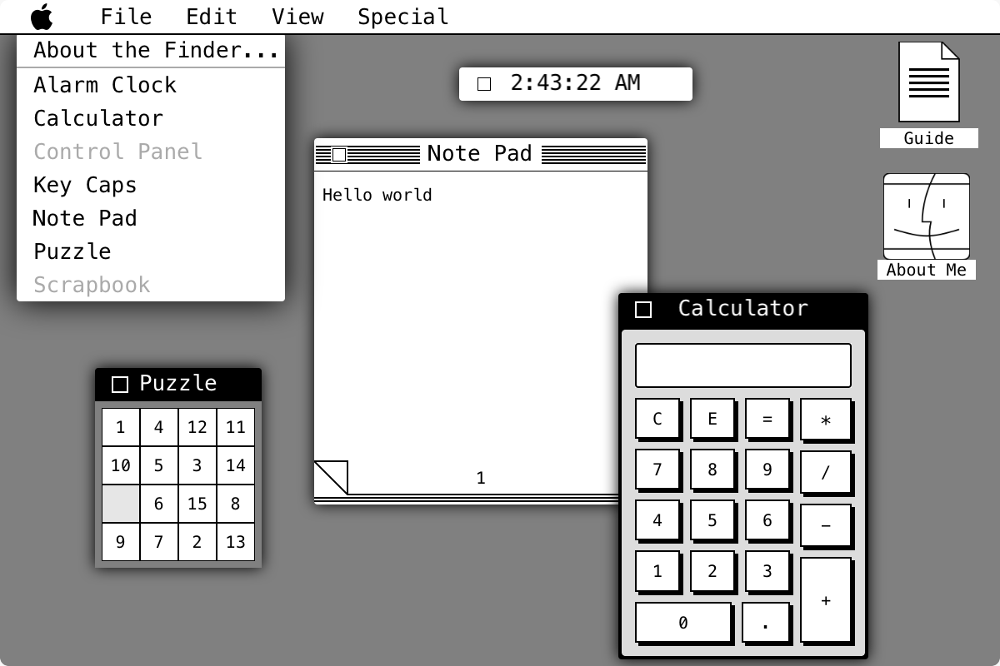
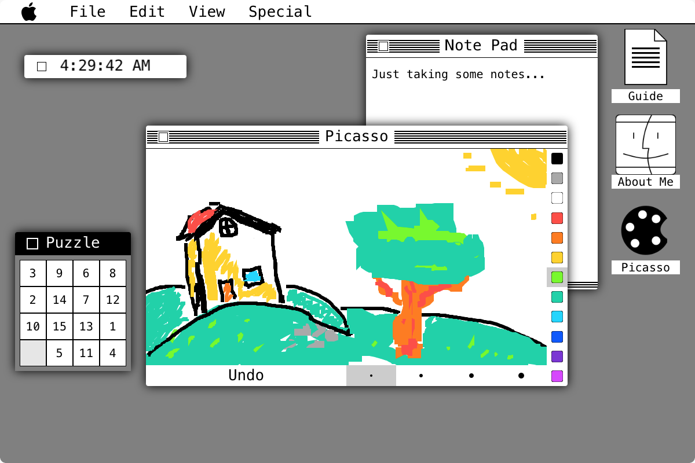
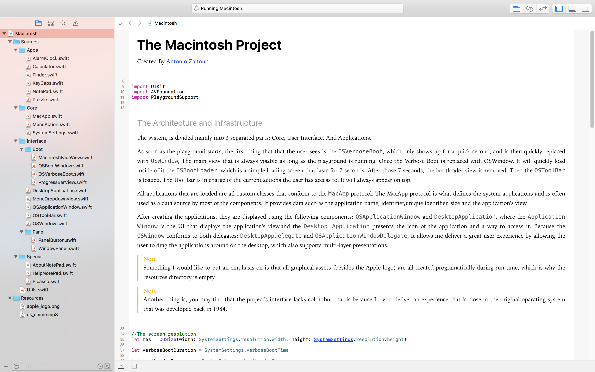

# The Macintosh Project
WWDC 2017 Scholarship Project

## About

I decided to make this playground all about the original Mac OS System 1, mostly due to the limitations that were set, where we are not suppose to make any network activity. So I thought about this for a while and I finally said "Why not just go back in time, to the age where the internet wasn't really a thing"

I started working on it March 8th, Finished and submitted the project on March 27th.

## Demo Video

Checkout the demo I made on [Youtube](https://www.youtube.com/watch?v=xsI5CaudNbQ)

## Screenshots

